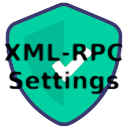
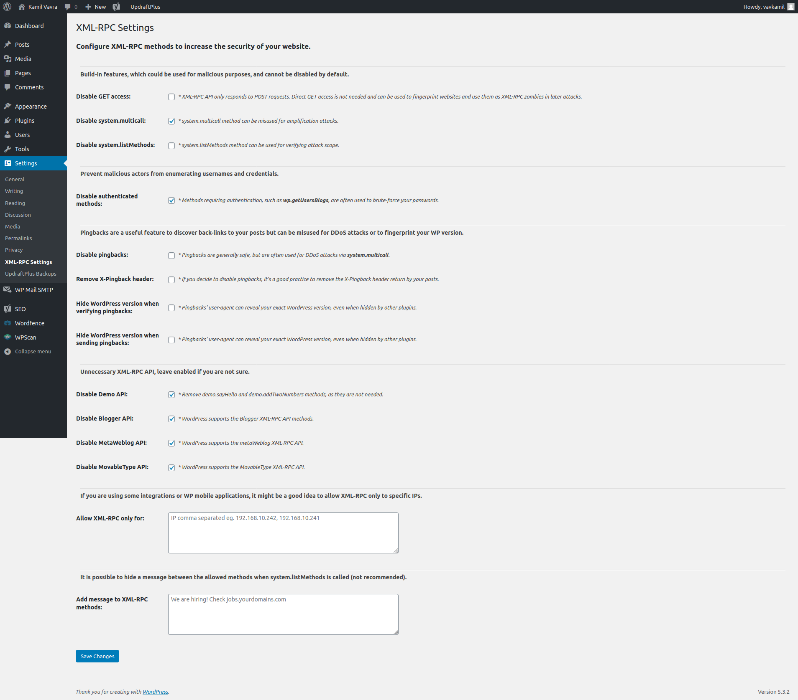

# XML-RPC Settings

Secure your website with the most comprehensive XML-RPC Settings plugin.

---

WordPress plugin to configure XML-RPC methods to increase the security of your website

Moved to the official WordPress Plugin Directory
https://wordpress.org/plugins/xml-rpc-settings/

---

## Screenshot

